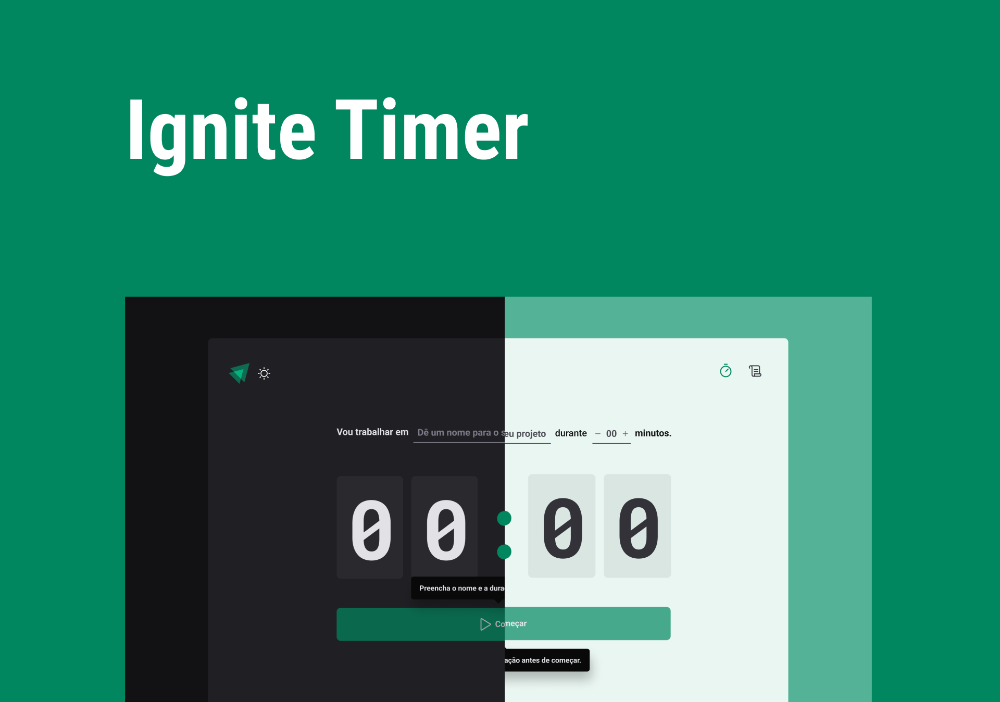

<h1 align="center">
    Ignite Timer
</h1>

<h1>
    
</h1>

## Descrição

O projeto **Ignite Timer** foi desenvolvido durante o treinamento **Ignite** da [Rocketseat](https://www.rocketseat.com.br/).
O **Ignite Timer** é uma aplicação de [Pomodoro](https://tecnoblog.net/responde/o-que-e-a-tecnica-pomodoro-timer-25-minutos/), aonde o usuário define tempo para manter 100% da concentração na atividade que está sendo realizada e ao fim desse tempo o usuário podera fazer um intervalo de 5min, por exemplo e retornar a atividade.

## Tecnologias

As tecnologias utilizadas para o desenvolvimento do **Ignite Timer** foram:

- [React](https://pt-br.reactjs.org/)
- [Typescript](https://www.typescriptlang.org/)
- [ReactRouterDOM](https://reactrouter.com/en/main)
- [StyledComponents](https://styled-components.com/)
- [ReactHookForm](https://react-hook-form.com/)
- [Zod](https://github.com/colinhacks/zod)
- [Immer](https://github.com/immerjs/immer)

 Desenvolvido por Henrique Santos 
